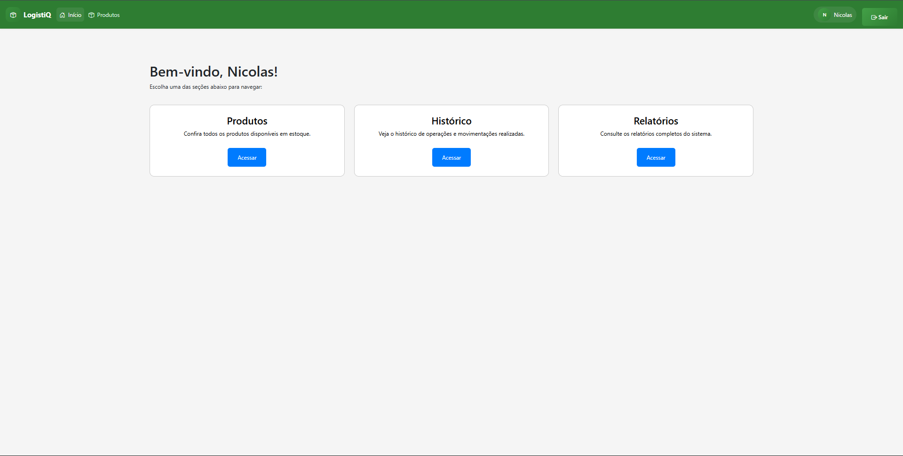

# 🧮 ControleEstoqueV2 ·  

Sistema web simples para controle de estoque, desenvolvido com Python e Flask. Ideal para pequenos negócios ou como projeto de aprendizado. Permite cadastrar usuários, gerenciar produtos e acompanhar movimentações de estoque.

## 📑 Tabela de Conteúdo
- [Funcionalidades](#funcionalidades)
- [Tecnologias Utilizadas](#tecnologias-utilizadas)
- [Estrutura do Projeto](#estrutura-do-projeto)
- [Instalação](#instalação)
- [Uso](#uso)
- [Dependências](#dependências)
- [Autor](#autor)

## ✅ Funcionalidades
- 👤 Cadastro e login de usuários
- 📦 Registro, edição e exclusão de produtos
- 📊 Visualização de estoque em tempo real
- 🔄 Controle de movimentações (entradas/saídas)

## 🛠 Tecnologias Utilizadas
- [Python 3](https://www.python.org/)
- [Flask](https://flask.palletsprojects.com/)
- [SQLite](https://www.sqlite.org/index.html)

## Estrutura do Projeto
```
ControleEstoqueV2/
├── app/
│   ├── __init__.py
│   ├── auth.py
│   ├── models.py
│   └── routes.py
│   └── static/
│       └── style.css
│   └── templates/
│       ├── index.html
│       ├── login.html
│       └── registro.html
├── instance/
│   └── estoque.dbas
├── requirements.txt
├── run.py
├── README.md
└── .gitignore
```

## Instalação
1. Clone o repositório:
   ```bash
   git clone https://github.com/NicolasGayb/ControleEstoqueV2.git
   ```
2. Crie e ative um ambiente virtual (opcional):
   ```bash
   python -m venv venv
   venv\Scripts\activate
   ```
3. Instale as dependências:
   ```bash
   pip install -r requirements.txt
   ```

## Uso
1. Execute o sistema:
   ```bash
   python run.py
   ```
2. Acesse no navegador: `http://localhost:5000`

## 🖥 Demonstração



## Dependências
Veja o arquivo `requirements.txt` para as bibliotecas necessárias.

## 👨‍💻 Autor

- **Nicolas Gabriel Rodrigues Leal**
- Email: [nicolasgbleal@gmail.com](mailto:nicolasgbleal@gmail.com)
- GitHub: [@NicolasGayb](https://github.com/NicolasGayb)
