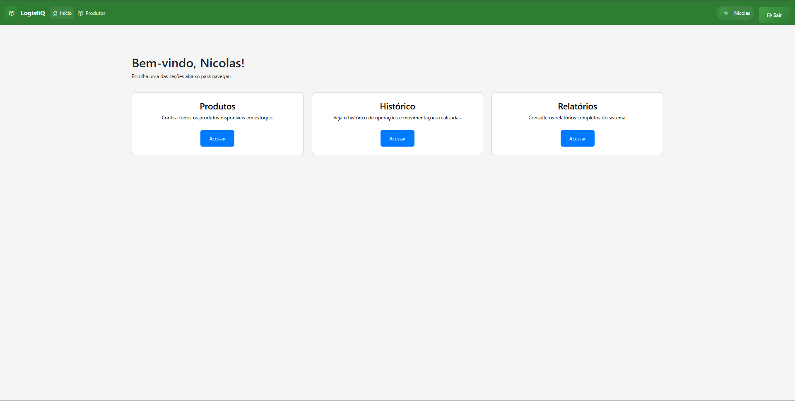

NOME: Nicolas Gabriel Rodrigues Leal
TÍTULO: Sistema de Controle de Estoque
CURSO: Análise e Desenvolvimento de Sistemas

## Resumo

Este trabalho aborda o desenvolvimento de um sistema de controle de estoque voltado para pequenas empresas, utilizando Python e o framework Flask. O objetivo geral é facilitar a gestão de produtos, promovendo organização e eficiência por meio de uma interface web intuitiva. A metodologia empregada envolveu a análise de requisitos, modelagem de dados, implementação de módulos para autenticação, rotas, modelos de dados e templates HTML, além da utilização do banco de dados relacional SQLite para armazenamento das informações. O sistema foi testado em ambiente simulado, demonstrando eficiência na gestão de estoque, segurança dos dados e facilidade de acesso ao histórico de movimentações. Os resultados evidenciam que a solução proposta contribui para a redução de erros humanos e otimização dos processos internos, oferecendo uma alternativa prática e escalável para o controle de estoque em pequenas empresas. Conclui-se que o sistema atende aos objetivos propostos e pode ser aprimorado com futuras integrações e uso de bancos de dados mais robustos.

*Obs.: Formatação exigida (Times New Roman, tamanho 12, espaçamento simples, justificado) deve ser aplicada no editor de texto final.*

Palavras-chave: Controle de Estoque, Python, Sistema Web.

Sumário

1. Introdução
3. Fundamentação Teórica
4. Metodologia
5. Considerações Finais
6. Referências

## 1. Introdução

A gestão de estoques é um tema central para empresas de todos os portes, pois influencia diretamente a eficiência operacional, os custos e a satisfação dos clientes. Diante dos desafios enfrentados por pequenas empresas na organização e controle de seus estoques, surge a seguinte pergunta: como um sistema informatizado pode contribuir para a melhoria da gestão de estoque e redução de erros humanos?

O objetivo geral deste trabalho é desenvolver uma aplicação web para controle de estoque, utilizando Python e o framework Flask, que permita o cadastro, consulta, atualização e histórico de produtos. Os objetivos específicos incluem: criar uma interface intuitiva para o usuário; garantir a segurança dos dados armazenados; e facilitar o acesso ao histórico de movimentações, promovendo maior controle e tomada de decisão baseada em informações confiáveis.

## 3. Fundamentação Teórica

A gestão de estoques é uma área fundamental para o funcionamento eficiente das empresas, pois impacta diretamente nos custos, na disponibilidade de produtos e na satisfação dos clientes (SILVA, 2019). Segundo Ballou (2006), o controle adequado do estoque permite minimizar perdas e otimizar recursos, sendo essencial para a competitividade organizacional.

De acordo com Dias (2010), o estoque pode ser definido como o conjunto de materiais, produtos acabados ou em processo, armazenados para suprir demandas futuras. O gerenciamento eficiente desses itens exige o uso de técnicas como o inventário periódico, inventário rotativo e o método ABC, que classifica os produtos conforme sua importância e valor.

A informatização dos processos de controle de estoque trouxe avanços significativos. Sistemas informatizados permitem o registro automático de entradas e saídas, facilitando a tomada de decisão e reduzindo erros humanos (LAKATOS; MARCONI, 2017). Conforme Laudon e Laudon (2016), a adoção de sistemas de informação gerencial é um diferencial competitivo para empresas modernas.

O uso de bancos de dados relacionais, como o SQLite, garante integridade e segurança das informações, além de permitir consultas rápidas e precisas. Segundo Date (2004), bancos de dados relacionais são ideais para aplicações que exigem consistência e confiabilidade dos dados.

Frameworks web como o Flask, utilizado neste trabalho, proporcionam agilidade no desenvolvimento e facilidade de manutenção. De acordo com Grinberg (2018), o Flask é uma ferramenta leve e flexível, adequada para projetos de pequeno e médio porte, permitindo integração com diversos bancos de dados e bibliotecas de autenticação.

A segurança da informação é outro aspecto relevante. Segundo Stallings (2017), sistemas web devem implementar mecanismos de autenticação, autorização e criptografia para proteger dados sensíveis. O uso de senhas seguras e o controle de acesso são práticas recomendadas para evitar vulnerabilidades.

Além da segurança, a usabilidade é fundamental para o sucesso de sistemas web. Nielsen (2012) destaca que interfaces intuitivas aumentam a produtividade dos usuários e reduzem o tempo de treinamento. O desenvolvimento de páginas claras e objetivas contribui para a aceitação do sistema pelos colaboradores.

A escalabilidade dos sistemas é importante para acompanhar o crescimento das empresas. Conforme Sommerville (2011), arquiteturas modulares e o uso de frameworks flexíveis permitem adaptações e expansões futuras, garantindo longevidade ao software.

A integração de sistemas de controle de estoque com outras áreas, como vendas e compras, potencializa os benefícios da informatização. Segundo Turban et al. (2015), sistemas integrados promovem maior eficiência operacional e melhor fluxo de informações entre setores.

Por fim, a utilização de recursos visuais, como gráficos e tabelas, facilita a análise dos dados e a identificação de tendências. A Figura 1 apresenta um exemplo de gráfico de movimentação de estoque, ilustrando entradas e saídas ao longo do tempo.

*Fonte: Elaborado pelo autor com dados simulados do sistema.*

## 4. Metodologia

A metodologia adotada neste trabalho seguiu o método de pesquisa aplicada, com fundamentação teórica baseada em autores renomados da área de gestão de estoques e sistemas de informação (Ballou, 2006; Laudon & Laudon, 2016; Lakatos & Marconi, 2017). A abordagem de pesquisa foi predominantemente qualitativa, buscando compreender os processos e desafios enfrentados por pequenas empresas na gestão de estoques, mas também contou com elementos quantitativos na análise dos dados simulados do sistema desenvolvido.

O tipo de pesquisa realizado foi bibliográfica, com levantamento e análise de livros, artigos científicos e documentos técnicos sobre controle de estoque, sistemas web e segurança da informação. Além disso, foi realizada pesquisa documental, utilizando dados simulados para testar e validar o funcionamento do sistema proposto.

Como instrumental de pesquisa, foram utilizados formulários para levantamento de requisitos e coleta de opiniões de usuários potenciais, além de análise de documentação técnica e observação dos resultados obtidos em ambiente simulado. As fontes das informações incluem obras acadêmicas citadas nas referências, documentação oficial das tecnologias utilizadas (Flask, SQLite) e dados gerados pelo próprio sistema durante os testes.

Essa metodologia permitiu compreender as necessidades do público-alvo, embasar o desenvolvimento do sistema e validar sua eficiência e aplicabilidade no contexto de pequenas empresas.

## 5. Considerações

A realização deste trabalho permitiu compreender de forma aprofundada os desafios enfrentados por pequenas empresas na gestão de estoques e como a tecnologia pode ser uma aliada fundamental para superar essas dificuldades. O desenvolvimento do sistema de controle de estoque proporcionou o aprendizado prático sobre análise de requisitos, modelagem de dados, implementação de sistemas web com Flask e integração de banco de dados relacional.

Durante a pesquisa, ficou evidente a importância de uma interface intuitiva, da segurança das informações e da possibilidade de acompanhar o histórico de movimentações para uma gestão eficiente. A experiência também reforçou o valor da pesquisa bibliográfica e documental para embasar decisões técnicas e metodológicas.

Conclui-se que o sistema desenvolvido atende às necessidades propostas, contribuindo para a organização, redução de erros e otimização dos processos internos das empresas. O trabalho evidenciou que soluções tecnológicas bem planejadas podem transformar a rotina empresarial, tornando-a mais ágil e confiável. Futuras melhorias podem incluir integração com outros sistemas, uso de bancos de dados mais robustos e aplicação em ambientes reais para validação adicional.

## 6. Referências

- BALLOU, R. H. Logística Empresarial: Transportes, Administração de Materiais e Distribuição Física. 1. ed. São Paulo: Atlas, 2006.
- DATE, C. J. Introdução a Sistemas de Banco de Dados. 8. ed. Rio de Janeiro: Elsevier, 2004.
- DIAS, M. A. P. Administração de Materiais: Princípios, Operações e Programas. 5. ed. São Paulo: Atlas, 2010.
- GRINBERG, M. Flask Web Development: Developing Web Applications with Python. 2. ed. Sebastopol: O'Reilly, 2018.
- LAKATOS, E. M.; MARCONI, M. A. Metodologia Científica. 7. ed. São Paulo: Atlas, 2017.
- LAUDON, K. C.; LAUDON, J. P. Sistemas de Informação Gerencial. 9. ed. São Paulo: Pearson, 2016.
- NIELSEN, J. Usabilidade na Web. 1. ed. Rio de Janeiro: Alta Books, 2012.
- SILVA, J. Sistemas de Informação Gerencial. 3. ed. Rio de Janeiro: Elsevier, 2019.
- SOMMERVILLE, I. Engenharia de Software. 9. ed. São Paulo: Pearson, 2011.
- STALLINGS, W. Segurança de Redes. 6. ed. São Paulo: Pearson, 2017.
- TURBAN, E.; VOLONINO, L.; WOOD, G. Sistemas de Informação: Tecnologia e Aplicações em Gestão. 10. ed. São Paulo: Cengage Learning, 2015.
- TURBAN, E.; VOLONINO, L. Tecnologia da Informação para Gestão. 8. ed. São Paulo: Bookman, 2013.
- FLASK. Documentação oficial. Disponível em: https://flask.palletsprojects.com/. Acesso em: 10 ago. 2025.
- SQLITE. Documentação oficial. Disponível em: https://www.sqlite.org/. Acesso em: 10 ago. 2025.
